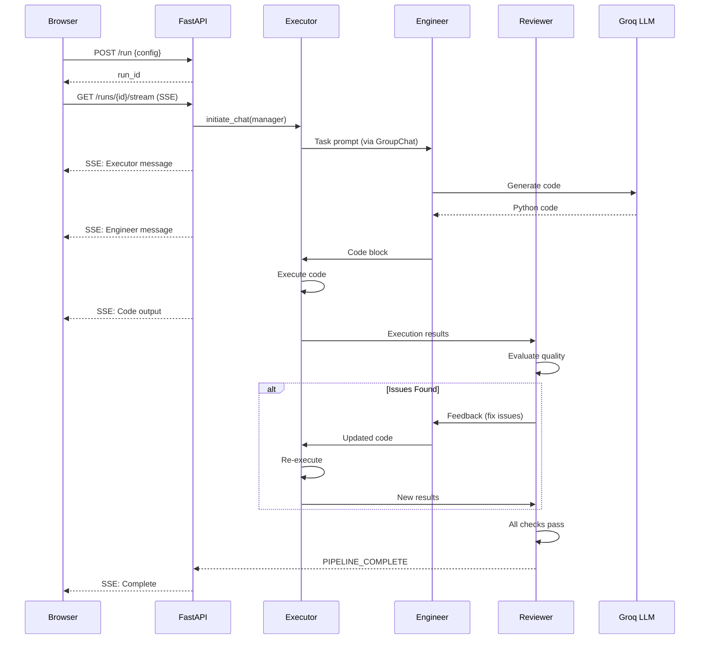

# CognitionFlow: Agentic Systems Lab

[](https://colab.research.google.com/github/ishan-1010/CognitionFlow/blob/main/CognitionFlow.ipynb)


#### Live Link: https://cognitionflow.onrender.com/

**CognitionFlow** is an applied AI engineering project that demonstrates a **three-agent system with a review loop**. An Executor, Engineer, and Reviewer collaborate via GroupChat — the Engineer writes code, the Executor runs it, and the Reviewer validates the output before approving. If the Reviewer finds issues, it sends feedback back to the Engineer for another iteration. This produces verified, high-quality artifacts.

The framework is **generalized**: choose from pre-built task templates (data analysis, code generation, reports, etc.) or supply custom prompts. Outputs are discovered dynamically.

---

## What's New in v3.0

- **Three-Agent Review Loop**: Engineer writes code → Executor runs it → Reviewer validates → iterates until quality passes
- **GroupChat Orchestration**: Deterministic speaker selection with `autogen.GroupChat` for structured multi-turn collaboration
- **Generalized Task Templates**: Data Analysis, Code Generator, Report Generator, Web Scraper, API Builder
- **Dynamic Artifact Discovery**: All generated files exposed via `/runs/{id}/artifacts/{filename}`
- **Improved Prompts**: Engineer forbidden from self-terminating; Reviewer controls pipeline completion
- **Clean Architecture**: Dead code removed (memory.py, anomaly_count), dependencies synced, frontend separated

---

## How It Works

```
┌─────────────┐     ┌──────────────┐     ┌──────────────┐
│   Executor   │────▶│   Engineer   │────▶│   Reviewer   │
│ (runs code)  │◀────│ (writes code)│◀────│ (validates)  │
└─────────────┘     └──────────────┘     └──────────────┘
       │                                        │
       │         Review Loop (GroupChat)         │
       │◀───────────────────────────────────────│
       │     If issues: back to Engineer         │
       │     If approved: PIPELINE_COMPLETE      │
```

1. **Executor** sends the task prompt to the GroupChat
2. **Engineer** writes complete Python code in a single block
3. **Executor** runs the code and reports output (exitcode, stdout)
4. **Reviewer** evaluates: execution success, artifact quality, constraint compliance
5. If issues found → back to **Engineer** with specific feedback
6. If all checks pass → **Reviewer** says `PIPELINE_COMPLETE`

---

## Key Features

| Feature | Description |
|---------|-------------|
| **Three-Agent Review Loop** | Engineer → Executor → Reviewer with iterative quality gates |
| **GroupChat Orchestration** | Deterministic speaker selection via `autogen.GroupChat` |
| **Task Templates** | 5 pre-built task types; custom prompts supported |
| **Dynamic Artifacts** | All generated files discovered and served by name |
| **Real-time Streaming** | Server-Sent Events for live agent conversation |
| **Memory Optimized** | Concurrent run limiter (2 max), workspace cleanup, Agg backend |
| **Production Ready** | Rate limiting (10 req/min), SQLite history, /metrics endpoint |

---

## Technologies Used

* **Core:** Python 3.10+, FastAPI, SQLite
* **Orchestration:** Microsoft AutoGen (GroupChat, UserProxy, AssistantAgent)
* **Inference:** Groq LPU (Llama 3.3, Llama 3.1, Qwen, GPT-OSS)
* **Data/Viz:** Pandas, Polars, Seaborn, Matplotlib
* **Deployment:** Docker, Render-optimized (512MB)

---

## API Endpoints

| Endpoint | Method | Description |
|----------|--------|-------------|
| `/` | GET | Web UI with template selector and customization panel |
| `/config` | GET | Available models, modes, task templates, output formats |
| `/run` | POST | Start pipeline with optional config |
| `/runs/{id}` | GET | Run status and discovered artifacts list |
| `/runs/{id}/stream` | GET | SSE real-time agent messages |
| `/runs/{id}/artifacts/{filename}` | GET | Serve any artifact by name |
| `/history` | GET | Run history (paginated) |
| `/metrics` | GET | Success rates, avg duration |
| `/health` | GET | Liveness check |

### Run Configuration

```json
{
  "task_prompt": "Optional custom prompt (overrides template)",
  "template_id": "data_analysis",
  "output_format": "markdown",
  "model": "llama-3.1-8b-instant",
  "temperature": 0.7,
  "agent_mode": "standard"
}
```

- **Task templates:** `data_analysis`, `code_generator`, `report_generator`, `web_scraper`, `api_builder`
- **Output formats:** `markdown`, `json`, `code`, `plot`, `auto`
- **Models:** `llama-3.1-8b-instant`, `llama-3.3-70b-versatile`, `openai/gpt-oss-120b`, `qwen/qwen3-32b`
- **Agent modes:** `standard`, `detailed`, `concise`

---

## Architecture



---

## How to Run

### Option 1: Run in Cloud (Recommended)
Click the badge above to open the notebook in Google Colab. You will need your own API keys.

### Option 2: Run Locally

**Prerequisites:** Python 3.10+ and an API Key (Groq or OpenAI).

1. **Clone the repository**
```bash
git clone https://github.com/ishan-1010/CognitionFlow.git
cd CognitionFlow
```

2. **Install dependencies**
```bash
pip install -r requirements.txt
```

3. **Set Environment Variables**
```bash
export GROQ_API_KEY="your_key_here"
```

4. **Run the API**
```bash
uvicorn api.main:app --reload --host 0.0.0.0 --port 8000
```

### Option 3: uv (recommended for local dev)
```bash
cd CognitionFlow
uv venv --python 3.12
source .venv/bin/activate
uv sync --all-extras
cp .env.example .env  # add your GROQ_API_KEY
uv run uvicorn api.main:app --reload
```

### Docker
```bash
docker build -t cognitionflow .
docker run -p 8000:8000 -e GROQ_API_KEY=your_key cognitionflow
```

### Deploy (Render, Railway, Fly.io)
Set `GROQ_API_KEY` in environment; run `uvicorn api.main:app --host 0.0.0.0 --port $PORT`.

**Memory optimized for Render free tier (512MB).**

---

## License

This project is released under the MIT License.
