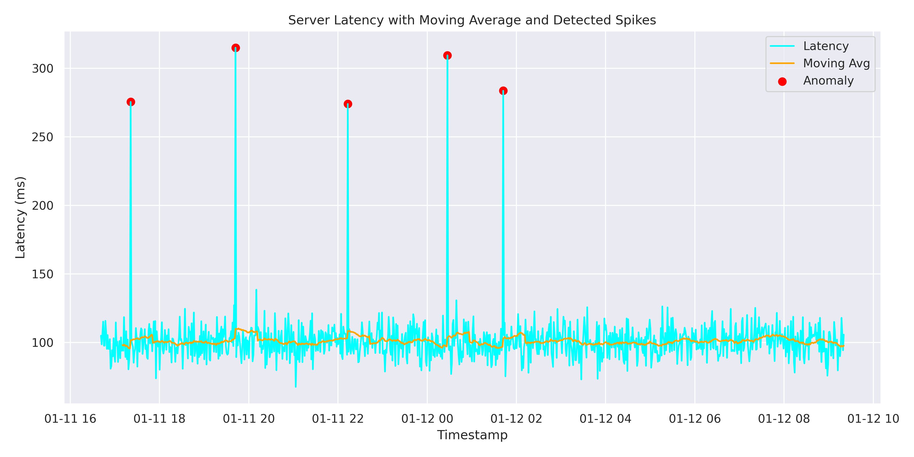
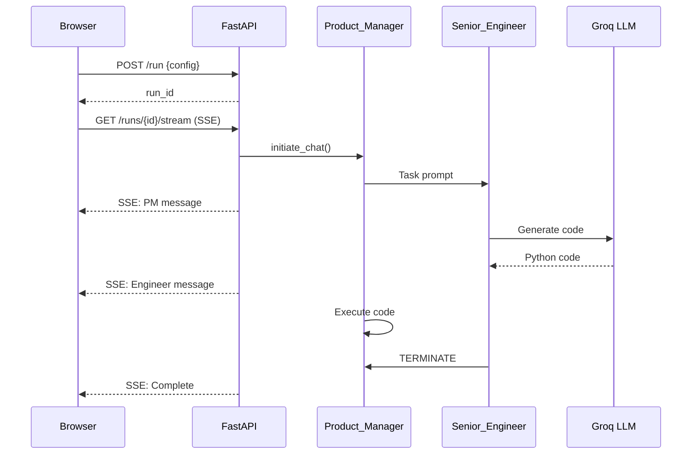

# CognitionFlow: Agentic Systems Lab

[](https://colab.research.google.com/github/ishan-1010/CognitionFlow/blob/main/CognitionFlow.ipynb)


#### Live Link: https://cognitionflow.onrender.com/

**CognitionFlow** is an applied AI engineering project that explores the design and behavior of **multi-agent systems** with persistent vector memory. The project demonstrates how multiple AI agents can collaborate, retain context over time, and generate analytical artifacts through structured orchestration rather than single-prompt interactions.

This repository serves as a **systems-level prototype**, focusing on architecture, reasoning flow, and agent coordination using **Microsoft AutoGen**.

---

## 🆕 What's New in v2.0

- **User Customization**: Configure task prompts, LLM models, temperature, anomaly patterns, and agent verbosity
- **Memory Optimization**: Concurrent run limiter, automatic workspace cleanup, optimized for Render free tier (512MB)
- **Production Features**: Rate limiting, SQLite run history, /metrics endpoint
- **Enhanced UI**: Collapsible advanced options panel with real-time configuration

---

## Generated Artifacts & Analysis

Unlike standard chatbots, this system generates tangible outputs. Below is an example of the system health analysis generated autonomously by the *Analyst Agent* after interpreting synthetic log data:


*(Figure: Multi-agent generated analysis of system metrics)*

---

## Project Overview

Modern LLM applications often rely on single-agent prompt chains, which limit scalability and collaborative reasoning. This project investigates an **agent orchestration** approach where:

* **Distinct Roles:** Agents assume specialized personas (e.g., *Coordinator, Executor, Analyst*).
* **Autonomous Loops:** Agents collaborate to simulate problem-solving workflows without human intervention.
* **Artifact Generation:** Outputs include both reasoning traces and generated files (plots, reports).
* **User Customization:** Configurable prompts, models, and analysis parameters.

## Key Features

| Feature | Description |
|---------|-------------|
| **Multi-Agent Architecture** | Explicit role assignment using the AutoGen framework |
| **Customizable Analysis** | Configure prompts, models (Llama 3, Mixtral), temperature, anomaly patterns |
| **Memory Optimized** | Concurrent run limiter (2 max), workspace cleanup, Agg backend |
| **Production Ready** | Rate limiting (10 req/min), SQLite history, /metrics endpoint |
| **Real-time Streaming** | Server-Sent Events for live agent conversation |

---

## Technologies Used

* **Core:** Python 3.10+, FastAPI, SQLite
* **Orchestration:** Microsoft AutoGen
* **Inference:** Groq LPU (Llama 3, Mixtral)
* **Data/Viz:** Polars, Seaborn, Matplotlib
* **Deployment:** Docker, Render-optimized

---

## API Endpoints

| Endpoint | Method | Description |
|----------|--------|-------------|
| `/` | GET | Web UI with customization panel |
| `/config` | GET | Available models, modes, defaults |
| `/run` | POST | Start analysis with optional config |
| `/runs/{id}` | GET | Run status and artifacts |
| `/runs/{id}/stream` | GET | SSE real-time messages |
| `/history` | GET | Run history (paginated) |
| `/metrics` | GET | Success rates, avg duration |
| `/health` | GET | Liveness check |

### Run Configuration

```json
{
  "task_prompt": "Custom analysis prompt...",
  "model": "llama3-8b-8192",
  "temperature": 0.7,
  "anomaly_count": 5,
  "agent_mode": "standard"
}
```

Available models: `llama3-8b-8192`, `llama3-70b-8192`, `mixtral-8x7b-32768`
Agent modes: `standard`, `detailed`, `concise`

---

## How to Run

### Option 1: Run in Cloud (Recommended)
Click the badge above to open the notebook directly in Google Colab. You will need your own API keys.

### Option 2: Run Locally

**Prerequisites:** Python 3.10+ and an API Key (Groq or OpenAI).

1. **Clone the repository**
```bash
git clone https://github.com/ishan-1010/CognitionFlow.git
cd CognitionFlow
```

2. **Install dependencies**
```bash
pip install -r requirements.txt
```

3. **Set Environment Variables**
```bash
export GROQ_API_KEY="your_key_here"
```

4. **Run the API**
```bash
uvicorn api.main:app --reload --host 0.0.0.0 --port 8000
```

### Option 3: uv (recommended for local dev)
```bash
cd CognitionFlow
uv venv --python 3.12
source .venv/bin/activate
uv sync --all-extras
cp .env.example .env  # add your GROQ_API_KEY
uv run uvicorn api.main:app --reload
```

### Docker
```bash
docker build -t cognitionflow .
docker run -p 8000:8000 -e GROQ_API_KEY=your_key cognitionflow
```

### Deploy (Render, Railway, Fly.io)
Set `GROQ_API_KEY` in environment; run `uvicorn api.main:app --host 0.0.0.0 --port $PORT`.

**Memory optimized for Render free tier (512MB).**

---

## Architecture



---

## License

This project is released under the MIT License.
